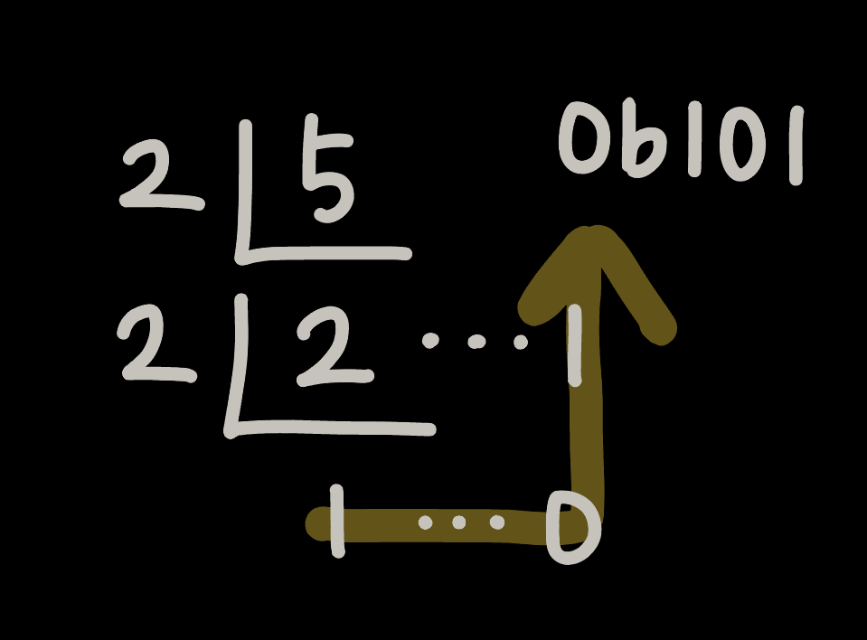
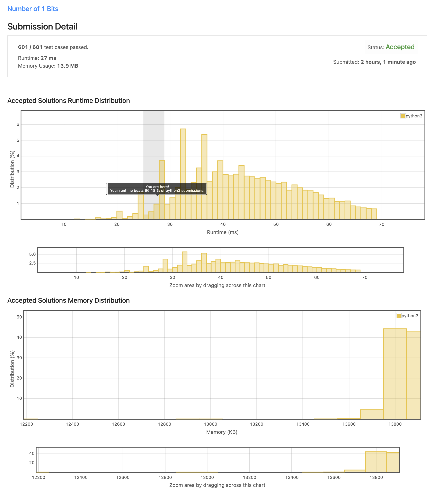

# 191. Number of 1 Bits

## [Problem](https://leetcode.com/problems/number-of-1-bits/)

### Description

Write a function that takes an unsigned integer and returns the number of '1' bits it has (also known as the [Hamming weight](http://en.wikipedia.org/wiki/Hamming_weight)).

**Note:**

- Note that in some languages, such as Java, there is no unsigned integer type. In this case, the input will be given as a signed integer type. It should not affect your implementation, as the integer's internal binary representation is the same, whether it is signed or unsigned.
- In Java, the compiler represents the signed integers using [2's complement notation](https://en.wikipedia.org/wiki/Two's_complement). Therefore, in **Example 3**, the input represents the signed integer. `-3`.

**Example 1:**

```
Input: n = 00000000000000000000000000001011
Output: 3
Explanation: The input binary string 00000000000000000000000000001011 has a total of three '1' bits.
```

**Example 2:**

```
Input: n = 00000000000000000000000010000000
Output: 1
Explanation: The input binary string 00000000000000000000000010000000 has a total of one '1' bit.
```

**Example 3:**

```
Input: n = 11111111111111111111111111111101
Output: 31
Explanation: The input binary string 11111111111111111111111111111101 has a total of thirty one '1' bits.
```

**Constraints:**

- The input must be a **binary string** of length `32`.

**Follow up:**

- If this function is called many times, how would you optimize it?

### 문제 해석

> TL;DR
>
> unsigned integer로 표현된 수에서 `1`의 개수를 구하라

unsigned integer를 받아서 가지고 있는 `1` 비트의 개수를 반환하라 (hamming weight라고 알려져 있다)

노트:

- Java 같은 몇몇 언어에서는 unsigned integer 타입이 존재하지 않는다. 이런 경우 입력은 signed integer 타입으로 지원된다. 정수 내부의 이진 표현이 동일하기 때문에 signed 또는 unsigned 여부가 구현에 영향을 미치지는 않는다.
- Java 컴파일러는 signed integer를 2의 보수의 형태로 표현한다. 그러므로 `3`의 경우는 signed integer에서는 `-3`으로 표현한다.

## Solution

### Solution 1

#### 풀이

Python에서 정수를 2진수 문자열로 변경해주는 `bin` 메서드를 사용해서 푼다.

`bin` 메서드가 반환하는 문자열의 최대 길이는 `32`, 변환된 문자열에서 `'1'` 의 개수를 `count` 메서드를 활용해서 측정한다.

길이가 `32`인 문자열에 대한 `count` 메서드이므로 해당 풀이의 시간 복잡도는 `O(1)`이 된다.

**최종 시간복잡도: `O(1)`**

#### 소스 코드

```python
class Solution:
    def hammingWeight(self, n: int) -> int:
        return bin(n).count('1')
```

### Solution 2

#### 풀이

수학에서 n진법으로 표현할 때 사용한 방법을 여기서 사용해 보았음.

예를 들어 5를 2진법으로 나타낼 경우, 몫이 1이 될 때까지 나누면서 그에 따른 몫과 나머지로 2진법을 표현할 수 있다(아래 그림 참고).



반복하는 과정동안 등장한 모든 나머지와 최종 몫(1)을 더한다.

해당 풀이는 최대 32번(integer를 2진법으로 표현했을 경우의 최대 자리수) 반복하지만 위 풀이에 비해 `bin` 메서드를 사용하지 않으므로 조금은 더 이득으로 보여짐

**최종 시간복잡도: `O(1)`**

#### 소스 코드

```python
class Solution:
    def hammingWeight(self, n: int) -> int:
        quotient = n
        answer = reminder = 0

        while True:
            quotient, reminder = divmod(quotient, 2)
            answer += reminder

            if quotient in (0, 1):
                answer += quotient
                break

        return answer
```

### 실행 결과



### [Best Practice](<https://leetcode.com/problems/number-of-1-bits/discuss/1044775/Python-n-and-(n-1)-trick-%2B-even-faster-explained>)

```python
class Solution:
    def hammingWeight(self, n):
        ans = 0
        while n:
            n &= (n - 1)
            ans += 1
        return ans
```

2진수의 특성을 활용한 풀이이다.

위 풀이의 예를 들어보면 아래와 같다.

- `0b1000 & 0b0111` → `0b0000`
- `0b1011 & 0b1010` → `0b1010`
- `0b1010 & 0b1001` → `0b1000`

기존의 수에서 1을 뺀 후 AND 비트 연산(`&`)을 하면 전체 Bits에서 1이 하나 제거된다.

위 방식을 숫자가 0이 될 떄까지 반복하면서 총 반복한 횟수를 더하면 전체 Bits에서 1의 개수와 동일해진다.

해당 알고리즘은 문제에서 소개한 것과 같이 Hamming Weight 알고리즘 중 1가지 방법이다. 추가적인 알고리즘에 대해서는 아래의 블로그 글을 참고해보면 좋을 듯 하다.

> [[Algorithm] Hamming Weight (Bit Count) - Shumin's Blog](http://shumin.co.kr/algorithm-hamming-weight-bit-count/)

## 관련 학습

### String의 `count()`

문자열에서 특정 문자가 등장한 횟수를 구하고자 할 때 사용하는 메서드이다.

`count()` 메서드의 인자로 특정 문자를 전달해주면 해당 문자가 문자열에 등장한 횟수를 반환한다.

```python
'hello'.count('h') # 결과: 1
'hello'.count('l') # 결과: 2
'hello'.count('k') # 결과: 0
```

### `bit_count()`

python에서 integer의 2진법 표현 시에 1의 개수를 반환하는 메서드이다.

해당 메서드의 내부 동작은 `bin().count('1')`과 동일하다고 [공식 문서](https://docs.python.org/ko/3.10/library/stdtypes.html#int.bit_count)에서는 말하고 있다.

```python
n = 19 # 2진법: 0b10011
n.bit_count() # 결과: 3
```
