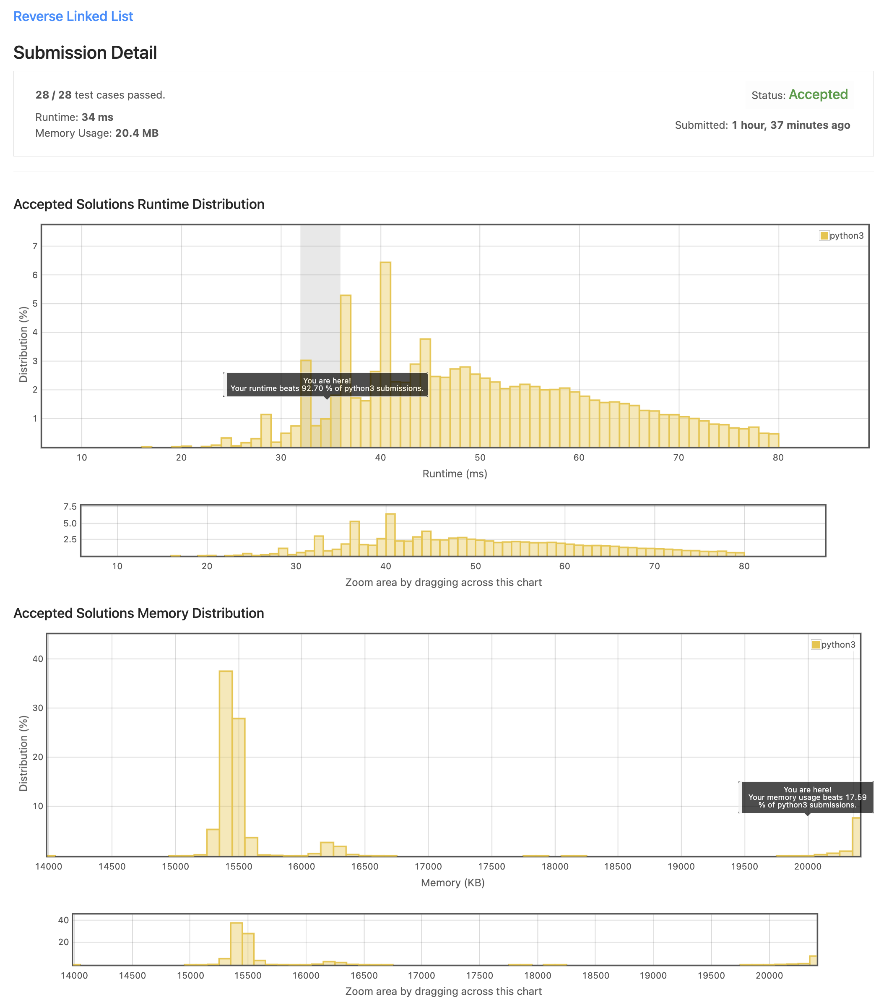

# 206. Reverse Linked List

## [Problem](https://leetcode.com/problems/reverse-linked-list/)

### Description

Given the head of a singly linked list, reverse the list, and return the reversed list.

**Example 1:**


```
Input: head = [1,2,3,4,5]
Output: [5,4,3,2,1]
```

**Example 2:**


```
Input: head = [1,2]
Output: [2,1]
```

**Example 3:**

```
Input: head = []
Output: []
```

**Constraints:**

- The number of nodes in the list is the range `[0, 5000]`.
- `-5000 <= Node.val <= 5000`

**Follow up:**

- A linked list can be reversed either iteratively or recursively. Could you implement both?

### 문제 해석

> TL;DR
>
> 전달받은 Linked List를 뒤집은 후의 head를 반환하라

Linked list의 head가 주어진다. 리스트를 뒤집고 뒤집어진 리스트를 반환하라.

## Solution

### Solution 1

#### 풀이

> Recursion을 사용한 풀이

현재 노드(`node`)와 초기화 할 앞선 노드(`prev`)를 파라미터로 가지는 Recursion 함수를 구현한다.

만약 전달받은 `node`가 `None`이라면 `prev`는 주어진 리스트에서의 가장 마지막 노드(reverse한 리스트에서는 head)가 된다. 따라서 해당 조건에서는 함수에서 `prev`를 반환한다.

`node.next` 값을 초기화 할 것이기 때문에 임시 변수(`next`)에 저장하고 `node.next`를 `prev`로 초기화 한다.

다시 함수 자기 자신을 호출하면서 각각의 파라미터에 대한 인자로 `node`로는 `next`를, `prev`로는 `node`를 전달하여 호출하고 그 결과를 반환한다.

재귀 호출이 모두 끝나고 난 뒤 최종적으로 반환되는 값은 마지막 노드, 즉 reverse 후의 head 노드가 반환된다.

시간복잡도는 주어진 리스트를 모두 순회해야 하기 때문에 `O(n)`이 된다.

**최종 시간복잡도: `O(n)`**

#### 소스 코드

```python
# Definition for singly-linked list.
# class ListNode:
#     def __init__(self, val=0, next=None):
#         self.val = val
#         self.next = next

class Solution:
    def reverseList(self, head: Optional[ListNode]) -> Optional[ListNode]:
        return self.reverseNode(head, None)

    def reverseNode(self, node, prev) -> ListNode:  # prev -> current
        """
        :type node: Optional[ListNode]
        :type prev: Optional[ListNode]
        :rtype :Optional[ListNode]
        """
        if not node:
            return prev

        next, node.next = node.next, prev
        return self.reverseNode(next, node)
```

### Solution 2

#### 풀이

> Iteration을 사용한 풀이

위의 Recursion을 사용한 풀이와 개념은 모두 동일하다. 일반적으로 recursion을 iteration으로 변경한 풀이로 보면 될 듯 하다.

**최종 시간복잡도: `O(n)`**

#### 소스 코드

```python
# Definition for singly-linked list.
# class ListNode:
#     def __init__(self, val=0, next=None):
#         self.val = val
#         self.next = next

class Solution:
    def reverseList(self, head: Optional[ListNode]) -> Optional[ListNode]:
        prev, current = None, head

        while current:
            current.next, prev, current = prev, current, current.next

        return prev
```

### 실행 결과



### Best Practice

이번 문제의 경우 best practice가 내가 작성한 코드와 동일해서 따로 추가하지 않았다.
