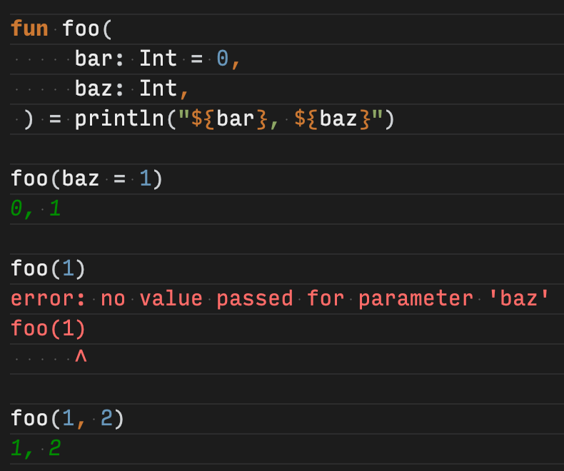

# Named arguments

### Task - Named arguments

Make the function `joinOptions()` return the list in a JSON format (for example, `[a, b, c]`) by specifying only two arguments.

[Default and named](https://kotlinlang.org/docs/functions.html#default-arguments) arguments help to minimize the number of overloads and improve the readability of the function invocation. The library function [`joinToString`](https://kotlinlang.org/api/latest/jvm/stdlib/kotlin.collections/join-to-string.html) is declared with default values for parameters:

```kotlin
fun joinToString(
    separator: String = ", ",
    prefix: String = "",
    postfix: String = "",
    /* ... */
): String
```

It can be called on a collection of Strings.

```kotlin
fun joinOptions(options: Collection<String>) =
        options.joinToString(TODO())
```

### Answer

```kotlin
fun joinOptions(options: Collection<String>) =
        options.joinToString(prefix = "[", postfix = "]")
```

separator는 기본 값으로 `", "` 를 가지고 있기 때문에 파라미터로 넘겨줄 필요가 없다.

### Learning

#### [Default arguments](https://kotlinlang.org/docs/functions.html#default-arguments)

함수 파라미터는 기본 값을 가질 수 있는데, 이는 (기본 값이 정의된) 파라미터를 스킵할 경우 사용된다. 이로 인해 overload의 수를 줄일 수 있다 :

```kotlin
fun read(
    b: ByteArray,
    off: Int = 0,
    len: Int = b.size,
) { /*...*/ }
```

기본 값은 타입 선언 옆에 `=` 를 사용하여 정의할 수 있다.

overriding 메서드의 경우 항상 base 메서드의 파라미터 기본 값을 사용한다. overriding 메서드가 기본 값을 가져야 할 경우, 파라미터의 기본 값은 함수 signiture에서 반드시 생략되어야 한다.

```kotlin
open class A {
    open fun foo(i: Int = 10) { /*...*/ }
}

class B : A() {
    override fun foo(i: Int) { /*...*/ }  // No default value is allowed.
}
```

.png>)

위와 같이 파라미터 기본 값이 정의되어 있는 base 메서드를 overriding 하면서, 해당 파라미터의 기본 값을 다시 재정의 할 경우 위와 같은 에러가 발생한다.

만약 기본 값이 정의된 파라미터가 기본 값이 정의되지 않은 파라미터 앞에 나올 경우, 함수를 호출할 때 (파라미터에 정의된) 기본 값은 named arguments를 통해서만 사용할 수 있다.

```kotlin
fun foo(
    bar: Int = 0,
    baz: Int,
) { /*...*/ }

foo(baz = 1) // The default value bar = 0 is used
```

named arguments를 사용하지 않으면 함수를 호출할 때 기본 값이 정의된 파라미터 부터 값이 할당되게 된다. 만약 named arguments를 사용하지 않으면서 baz의 값만 전달할 경우에는 에러가 발생한다.

```kotlin
foo(1) // error: no value passed for parameter 'baz'
```



만약 기본 값이 정의된 파라미터 뒤에 들어올 마지막 인자가 [lambda](https://kotlinlang.org/docs/lambdas.html#lambda-expression-syntax)일 경우, named arguments를 사용하거나 [outside of parentheses](https://kotlinlang.org/docs/lambdas.html#lambda-expressions-and-anonymous-functions)를 사용하여서 해결할 수 있다 :

```kotlin
fun foo(
    bar: Int = 0,
    baz: Int = 1,
    qux: () -> Unit,
) { /*...*/ }

foo(1) { println("hello") }     // Uses the default value baz = 1
foo(qux = { println("hello") }) // Uses both default values bar = 0 and baz = 1
foo { println("hello") }        // Uses both default values bar = 0 and baz = 1
```
